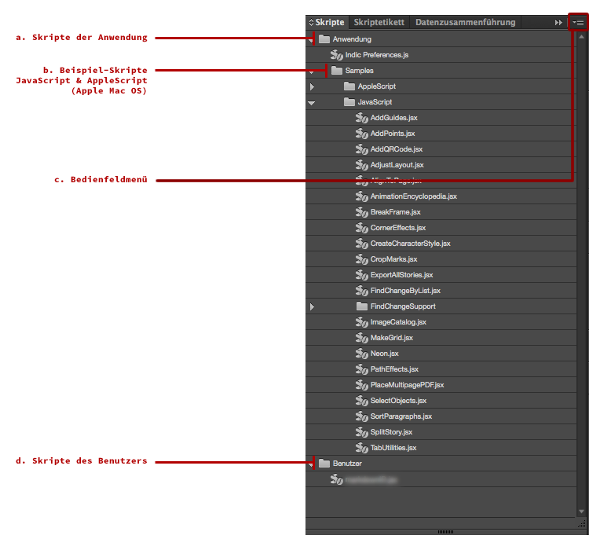
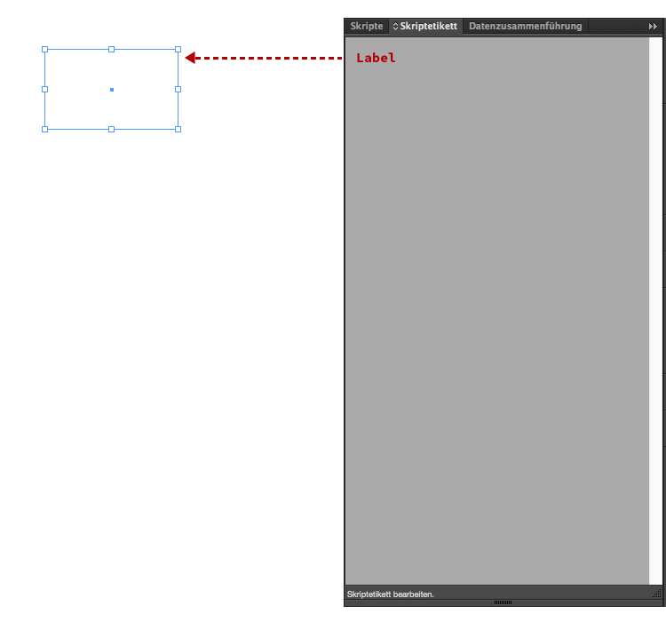
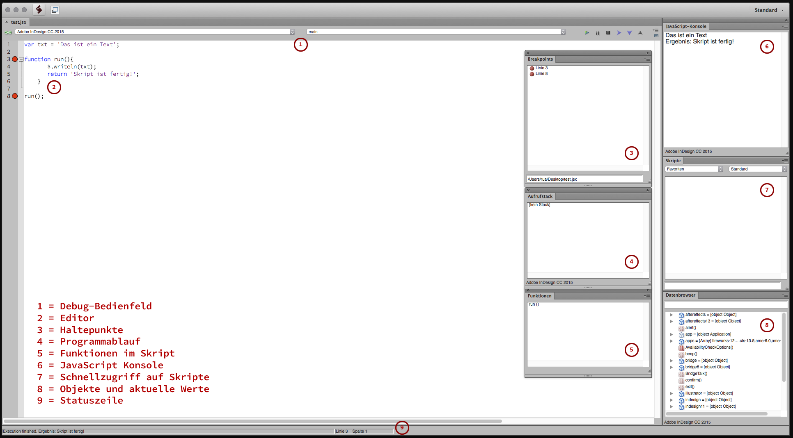

## Grundlegendes

Adobe InDesign kann über verschiedene Schnittstellen gesteuert werden. Im Zusammenhang mit Skripten, wie sie hier behandelt werden, können diese Schnittstellen mit JavaScript, AppleScript und VBScript angesprochen werden. VBScript ist eine von Microsoft entwickelte Skriptsprache. Sie ist nur unter Windows verfügbar. AppleScript ist ein Bestandteil des Apple Betriebssystems Mac OS. Es dient hauptsächlich dazu, Mac-OS-Programme zu automatisieren oder erweitern. JavaScript wurde ursprünglich für dynamisches HTML in Webbrowsern entwickelt und 1995 von Netscape veröffentlicht. Im Unterschied zu VBScript und AppleScript ist JavaScript nicht an eine Betriebssystemplattform gebunden. Es kann auf allen wichtigen Betriebssystemen ausgeführt werden. Deshalb wird im weiteren Verlauf ausschliesslich mit JavaScript und Adobe ExtendScript gearbeitet. 

Adobe ExtendScript ist eine erweiterte Implementierung von JavaScript. Sie wurde speziell für den Einsatz in Adobe Programmen ausgearbeitet. Die JavaScript-Syntax basiert auf der [ECMA-Spezifikation][3]. Das ist eine internationale Norm die unter anderem den Sprachumfang von JavaScript festlegt. Sie ist als eine Art Vorgabe, wie zum Beispiel die Deutsche Rechtschreibung für Deutsch, zu verstehen. Adobe ExtendScript bietet darüber hinaus Erweiterungen, die nur im Umfeld von Adobe Programmen eingesetzt werden können. Die Sprache bedient sich im Kern bei JavaScript, hat aber auch eigene Befehle und Anwendungs-Szenarien. **Für die Arbeit mit Adobe ExtendScript ist deshalb wesentlich, dass die Sprache in zwei Teilen verstanden werden muss. Zum einen gibt es die *Core JavaScript Elemente*, welche dem Standard von JavaScript entsprechen. Zum anderen gibt es die *Adobe ExtendScript Elemente*, welche durch Adobe definiert werden.** Es kann bei einfachen Aufgaben durchaus vorkommen, dass in einem Skript nur JavaScript, nicht aber ExtendScript Elemente vorkommen.

Das Adobe ExtendScript ***Toolkit*** ist die Entwicklungsumgebung für das Schreiben von JavaScript und Adobe ExtendScript-Code. Es besteht aus einem Texteditorfenster und einer Reihe von Werkzeugen für die Entwicklung von Skripten. Neben JavaScript und Adobe ExtendScript werden auch weitere Sprachen unterstützt. Im Rahmen dieser Dokumentation ist dies jedoch nicht von Bedeutung.

## Arbeitsumgebung

Die Schnittstelle oder das Interface ist der Teil eines Programms, welcher zur Kommunikation dient. Sie nimmt Informationen entgegen oder liefert diese aus. Bei Adobe InDesign ist das zum Beispiel die XML-, CSV- oder Excel-Schnittstelle. Im Prinzip ist auch die Benutzeroberfläche eine Schnittstelle. Sie nimmt die Befehle des Nutzers entgegen und weist das Programm an, diese auszuführen. Das Programm gibt das Ergebnis seiner Arbeit an das Interface zurück, welches dem Nutzer dann anzeigt, ob die Operation erfolgreich war oder nicht. Im Rahmen von Adobe InDesign Scripting gibt es somit die drei Schnittstellen für JavaScript, VBScript und AppleScript. Sie alle nehmen die Befehle eines Skripts entgegen, lassen das Programm diese ausführen und melden zurück, ob alle Operationen ausgeführt werden konnten. Damit dies funktioniert, müssen sich Skript-Autor und Programm auf eine gemeinsame Sprache einigen. Dabei hat das Betriebssystem ein Wörtchen mitzureden. Es ist die Kontrollinstanz, welche festlegt, welche Sprachen überhaupt zugelassen sind. Bei Windows sind das JavaScript und VBScript. Das Apple MacOS erlaubt dagegen JavaScript und AppleScript, nicht aber VBScript. Wenn ein Skript-Autor also will, dass seine Anweisungen bei allen Betriebssystemen verstanden werden, verfasst er seine Skripte in JavaScript respektive Adobe ExtendScript. 

In Adobe InDesign werden die Skripte über das Bedienfeld «Skripte» verwaltet. Es kann über *`Fenster > Hilfsprogramme > Skripte`* oder den Kurzbefehl `cmd + alt + F11` aufgerufen werden. Die Skripte im Ordner `Anwendung` sind für alle Benutzer des Systems erreichbar. Die Skripte im Ordner `Benutzer` können nur vom aktuell angemeldeten Benutzer gesehen werden. In diesem Ordner werden die eigenen Skripte abgelegt.

Skriptdateien für Adobe InDesign haben immer die Endungen *`.jsx`* oder *`.jsxbin`*. Bei *`.jsx`* kann der Skriptcode eingesehen werden. *`.jsxbin`* Dateien sind dagegen vorkompiliert, damit der Source Code nicht offenliegt. Das heisst, hier kann der Code nicht eingesehen werden. Weitere Informationen zur Anwendung in Skripten gibt es in der [Dokumentation zu Adobe InDesign][4].

### Adobe InDesign

Das *`Skripte`*-Bedienfeld in Adobe InDesign ist eine Art «Mini-Dateibrowser». Alle auf der Festplatte abgelegten Skripte werden angezeigt. Sie müssen dazu in einem der vorgesehenen Ordner liegen. Es können aber auch weitere Ordner oder Laufwerkverknüpfungen eingebunden werden. Die Anzeige der Ordner kann über einen Rechtsklick oder das Bedienfeldmenü mit dem Befehl *`Im Finder anzeigen`* respektive *`Im Explorer öffnen`* geöffnet werden. 

Jedes Adobe InDesign Objekt besitzt eine Eigenschaft mit dem Namen «Label». In der Palette *`Skriptetikett`* kann diese Eigenschaft beim angewählten Objekt (Textrahmen usw.) mit einem Wert gesetzt werden. Damit kann das Objekt in einem Skript explizit angesprochen werden. Wie das geht, wird später erklärt.

### Adobe ExtendScript Toolkit (ESTK)

Skripte für Adobe InDesign werden im Adobe ExtendScript Toolkit, kurz Adobe ESTK, erstellt. Das Programm gehört zum Leistungsumfang der Adobe CreativeCloud und ist kostenlos. In der Regel wird es mit der Installation von Adobe InDesign ausgeliefert. Ist dies nicht der Fall, kann es über [adobe.com/de/products/extendscript-toolkit.html][5] nachträglich heruntergeladen und installiert werden. 

Die Benutzeroberfläche des Adobe ESTK bietet im wesentlichen neun Elemente. Im *`Debug-Bedienfeld`* (1) wird die Zielapplikation eingestellt. Sie bestimmt, in welcher Adobe Applikation das geöffnete Skript ausgeführt wird. Der grösste Vorteil des Adobe ESTK im Vergleich zu einem Texteditor liegt darin, dass es mit der Zielapplikation verbunden ist. So können Skripte direkt aus dem Adobe ESTK in der betreffenden Applikation ausgeführt werden.

Im *`Editor`* (2) werden die Skripte geschrieben. Das Adobe ESTK bietet dabei eine Reihe von Hilfsmitteln. Zu den wichtigsten gehören die Autovervollständigung und das «Debugging». Bei der Autovervollständigung versucht das Adobe ESTK die begonnene Zeile fertig zu schreiben. Das spart Tipparbeit, sofern das Adobe ESTK den gewünschten Ausdruck in seinem Vocabulaire findet. Der Programmierer kann im aufpoppenden Overlay-Fenster den gewünschten Befehl wählen und mit der Eingabe- oder Tabulatortaste bestätigen. Hierbei ist wichtig, dass das richtige Object-Model eingestellt ist. Es kann im Flyout-Menü des *`Debug-Bedienfelds`* (1) eingestellt werden. 

Meist während, aber sicher am Ende der Skriptentwicklung, steht das «Debugging». Der Begriff «debugging» (zu deutsch entwanzen) basiert auf der von Grace Hopper eingeführten Bezeichnung für Fehler in Computersystemen. 1947 hatte während der Arbeiten am Mark II eine Motte für den Ausfall eines Relais gesorgt. Grace Hopper hat diese in sein Logbuch geklebt und mit dem Satz: «First actual case of bug being found.» («Das erste Mal, dass tatsächlich ein Bug gefunden wurde.») kommentiert. Mit Bugfix (engl. fix für reparieren, ausbessern) wird die Behebung eines Programmfehlers bezeichnet. Die wichtigsten «Debugging»-Helfer im Adobe ESTK sind unter anderem die roten Haltepunkte, welche zeilenweise gesetzt werden können. Sie werden zusammengefasst im Bedienfeld *`Breakpoints`* (3) angezeigt. Im `Debug-Bedienfeld` kann mit den blauen Pfeilen von Haltepunkt zu Haltepunkt gesprungen werden. Dieser Vorgang wird manchmal auch als Einzelschrittmodus bezeichnet.

Die Ereignisse und Ergebnisse des gesamten Programmablaufs, oder jene aus dem aktuellen Abschnitt des Einzelschrittmodus, werden in der *`JavaScript-Konsole`* (6) angezeigt. Sie kann jedoch auch zur Eingabe von Befehlen verwendet werden. Diese werden dann direkt im Adobe ESTK oder in der Zielapplikation ausgeführt.

Im Bedienfeld *`Aufrufstack`* (4) kann verfolgt werden, in welcher Zeile sich die Fehlersuche gerade befindet. Bei einfachen Skripten wird dieses Bedienfeld kaum gebraucht. Bei komplizierten und verschachtelten Skripten kann es jedoch helfen, den Überblick zu behalten.

Das Bedienfeld *`Funktionen`* (5) zeigt die Funktionen des Skripts. Der Doppelklick auf eine aufgeführte Funktion lässt den Editor auf eben diese springen.

Im Bedienfeld *`Skripte`* (7) können die vorhandenen Skripte zu einer Zielapplikation aufgerufen werden. Über das Flyout-Menü lassen sich auch eigene Favoriten hinzufügen.

Das Bedienfeld *`Datenbrowser`* (8) zeigt die verfügbaren Objekte für das aktuelle Skript sowie die Werte von Variablen während des «Debuggens». In der *`Statuszeile`* (9) werden verschiedene Angaben zum aktuellen Zustand des Adobe ESTK angezeigt.

[3]:http://www.ecma-international.org/publications/standards/Ecma-262.htm
[4]:https://helpx.adobe.com/de/indesign/using/scripting.html
[5]:https://www.adobe.com/de/products/extendscript-toolkit.html