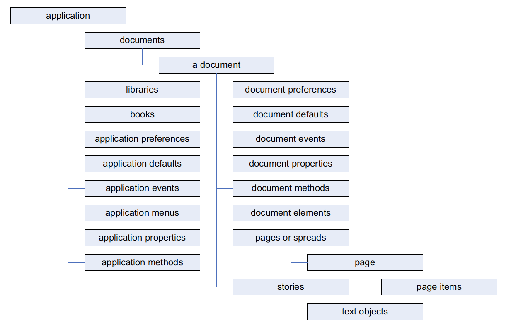

#### Skript 001, Dokument erstellen

Das erste Skript hat die Aufgabe, ein Dokument zu erstellen. Dieses wird nach dem Ablauf des Skripts geöffnet in Adobe InDesign zurückgelassen.

```javascript
// script.001.jsx

app.documents.add();
```

[\[ Download script.001.jsx as .zip \]](https://github.com/grafisches-forum-zh/scripting/wiki/source/script.001.zip) 


In JavaScript wird über die Punkt-Notation durch das *Dokument Object Model, kurz DOM* navigiert. Die Grundlagen dazu sind in diesem Wiki unter [03. JavaScript Grundlagen ](https://github.com/grafisches-forum-zh/scripting/wiki/03.-JavaScript-Grundlagen) erklärt. Dort ist unter anderem diese Grafik aufgeführt:

 

*(Quelle: Adobe InDesign CS6 Scripting Tutorial.pdf)*

`documents` ist ein Unterobjekt von `application`. `add()` ist eine Funktion (korrekterweise eine Methode) von `documents`.  Die Unterscheidung von Objekten, Kindobjekten und Objekt-Funktionen/Methoden und Eigenschaften ist besonders für Programmieranfänger schwer. Dieses und die kommenden Beispiele versuchen, etwas Klarheit zu schaffen. 

`app` repräsentiert `application`, also das Programm Adobe InDesign. `documents` steht im übertragenen Sinn für eine Sammlung von Dokumenten und deren Methoden/Eigenschaften – zum Beispiel neue Dokumente anlegen.

```Text
┌─────────────┐                                       
│     app     │                                       
└─────────────┘                                       
       │           ┌─────────────┐                    
       └───────────│  documents  │─ ─ ▶ add()         
                   └─────────────┘                    
```

#### Skript 002, Dokument erstellen & referenzieren

Der Ausdruck `app.documents.add()` ist für eine weitere Verwendung «wertlos». Das heisst, seine «Wirkung» verfällt, sobald das neue Dokument erstellt ist. In vielen Fällen ist es jedoch notwendig, dass nach dem Erstellen im weiteren Verlauf des Skripts auf das neue Dokument zugegriffen werden kann. Hierfür kann es mit einer Variable referenziert werden.

```javascript
var newDoc = app.documents.add();
newDoc;
```

[\[ Download script.002.jsx as .zip \]](https://github.com/grafisches-forum-zh/scripting/wiki/source/script.002.zip) 

Rudimentär formuliert passiet folgendes: Adobe InDesign erstellt ein neues Dokument. Die Variable `newDoc` referenziert das neue Dokument und all seine Funktionen/Methoden und Eigenschaften. Zu beachten ist, dass der Interpreter von rechts nach links und von innen nach aussen arbeitet. Das heisst, er erstellt zuerst das Dokument und weist es erst anschliessend der Variable `newDoc` zu. 

Mit den blauen Pfeiltasten im *`Debug-Bedienfelt`* des ESTK kann durch die einzelnen Zeilen des Skripts gesprungen werden. 


Nachdem der Interpreter in die zweite Skriptzeile gesprungen ist, kann im Bedienfeld *`Datenbrowser`* nach dem neu erstellten Dokument respektive dessen Referenz (`newDoc`) gesucht werden.  Wird das Bedienfeld nicht von Beginn an angezeigt, kann es im Menü *`Fenster`* aufgerufen werden. 

Die Aufgabe der zweiten Zeile hängt nicht mit der Anzeige im *`Datenbrowser`* zusammen, wie vielleicht vermutet.  Am Ende jedes Skripts sucht das Adobe ESTK nach einem Ergebnis. Kann dieses nicht ermittelt werden, schreibt das Programm `undefined` in die *`JavaScript-Konsole`*. Wenn zum Schluss des Skripts dagegen beispielsweise eine Variable aufgerufen wird, so wie in der zweiten Zeile, wird deren Ergebnis in die Konsole geschrieben. Wird die *`JavaScript-Konsole`* nicht von Anfang an angezeigt, kann sie im Menü *`Fenster`* aufgerufen werden.


#### Skript 003, Dokument speichern

Als nächstes soll das erstellte Dokument gespeichert werden. Hierzu ändern wir die letzte Zeile des Skripts in ` app.activeDocument.save(new File('~/Desktop/myname.indd'));`.

```Javascript
// script.003.jsx

var newDoc = app.documents.add();
app.activeDocument.save(new File('~/Desktop/myname.indd'));
```

[\[ Download script.003.jsx as .zip \]](https://github.com/grafisches-forum-zh/scripting/wiki/source/script.003.zip) 

Vereinfacht gesagt, erstellt der Interpreter von Adobe InDesign zuerst ein neues `File`-Objekt (`new File()`). Dieses beinhaltet eine Art Zeiger auf den gewünschten Speicherort und Dateinamen auf dem Betriebssystem – ungeachtet davon, ob dort wirklich ein Dokument existiert oder nicht. Anschliessend ermittelt der Interpreter das soeben erstellte und darum aktive Dokument in Adobe InDesign. Er speichert dieses unter dem gewünschten Pfad und Namen ab. 

Bezogen auf das *Dokument Object Model (DOM)* passiert folgendes:

```Text
                                ┌─────────────┐                                       
var newDoc = Neues Dokument aus │     app     │                                       
                                └─────────────┘                                       
                                       │           ┌─────────────┐                    
                                       └───────────│  documents  │─ ─ ▶ add()         
                                                   └─────────────┘                    
```

Die Variable `newDoc` referenziert das soeben durch `app.documents.add()` erstellte neue Dokument. Im Unterschied zum Skript 002 wäre es in Skript 003 nicht unbedingt nötig, das neu erstellte Dokument mit einer Variable zu referenzieren. Es gibt nach dem Erstellen keinen Zugriff mehr über die Variable (Referenz) `newDoc`. Dies weil das ExtendScript Objekt `app` eine Eigenschaft besitzt, welche das aktive Dokument referenziert: `activeDocument`. Das eigentliche Dokument ist wiederum eine Instanz der Klasse `Document`. (Jedes Dokument in Adobe InDesign ist eine Instanz der Klasse `Document`.) Diese enthält eine Methode, mit der ein Dokument gespeichert werden kann: `save()`.

```Text
          ┌────────────────┐      ┌─────────────┐                                   
          │     Class      │      │    Class    │ Vorgefertigter «Bauplan» ESTK 
          │    Document    │─ ┐   │    File     │ für die Arbeit mit Dokumenten     
          └────────────────┘      └─────────────┘                                   
                   ▲          │          │                                          
┌───────┐          │                      ─ ─ ─ ─ ─ ─ ─ ─                                   
│  app  │                     │                          │                                  
└───────┘          │                                     ▼                                  
    │     ┌────────────────┐  │        ┌─────────────────────────────────┐                
    └─────│ activeDocument │   ─▶ save( new File('~/Desktop/myname.indd') )               
          └────────────────┘           └─────────────────────────────────┘                
```

#### Skript 004, Dokment speichern *wenn möglich*

Das Skript 003 hat einige logische Fehler – auch wenn es seine Arbeit richtig macht. Wenn sich unter dem Pfad ` ~/Desktop/myname.indd` bereits ein gleichnamiges Dokument befindet, wird dieses überschrieben. Alle dort gespeicherten Änderungen gehen unwiderruflich verloren. Dieses Skript enthält nun einige rudimentäre Sicherheitsfunktionen.

```javascript
// script.004.jsx
 
var doc = '~/Desktop/myname.indd';
$.writeln('Datentype Variable \«doc\»: ' + typeof(doc));

doc = new File(doc);
$.writeln('Datentype Variable \«doc\»: ' + typeof(doc));

if(doc.exists == true) {
  $.writeln('Das Dokument existiert: '+ doc.exists);
  alert('Das Dokument existiert bereits. Der Befehl \«Speichern\» konnte nicht ausgeführt werden.');
}
else {
  $.writeln('Das Dokument existiert: '+ doc.exists);
  var newDoc = app.documents.add();
  if(app.activeDocument.saved == false) {
  app.activeDocument.save(doc);
  app.activeDocument.close();
  }
}
```

[\[ Download script.004.jsx as .zip \]](https://github.com/grafisches-forum-zh/scripting/wiki/source/script.004.zip) 

`var doc` referenziert auf einen `String` mit dem Inhalt `~/Desktop/myname.indd`.  Die folgende `$.writeln` Anweisung mit `typeof(doc)` analysiert den Datentyp von `doc` und schreibt diesen zusammen mit einem beschreibenden Text in die *`JavaScript-Konsole`*. `doc` ist zu diesem Zeitpunkt noch eine Instanz vom Typ `String`.  Danach wird `doc` mit sich selbst überschrieben. Bereits vorher wurde erwähnt: Der Interpreter arbeitet von rechts nach links und von innen nach aussen. Er erstellt mit `new File(__ARGUMENT__)` zuerst ein `File`-Objekt auf den Pfad von `doc`. Das übergebene `__ARGUMENT__` ist der `String`, auf den die Variable `doc` bis jetzt verweist. Anschliessend überschreibt der Interpreter den Ursprungswert von `doc` mit dem neuen Wert. Die nächste `$.writeln` Anweisung macht in der *`JavaScript-Konsole`* deutlich, dass sich nun der Typ der Variable geändert hat.  Die nachfolgenden Anweisungen und Schleifen sind durch die Skripte 001 bis 003 sowie  [sprachelemente.jsx](https://github.com/grafisches-forum-zh/scripting/wiki/08.-Skripte-allgemein#inhalt-sprachelementejsx) nachvollziehbar.

Warum dieses «Umschreiben» der Variable `doc`? Der Pfad auf das zu erstellende Dokument muss nur ein Mal zu Beginn des Skripts definiert werden. Anschliessend wird immer mit dem Bezeichner der `doc` gearbeitet. Dadurch wird das Skript einfach wartbar und anpassbar. Der Pfad muss nicht bei jedem Aufruf als Klartext ersetzt werden.